# Information Architecture (IA)

# TourMate Quest — Learner-Focused Navigation and Content Structure

**Parent product:** TourMate AI  
**Version:** 1.0  
**Date:** 2026-08-19  
**Status:** Target architecture with backward-compatible migration

---

## 1. Purpose

This document organizes TourMate AI around the tasks a tourism student wants to accomplish:

- Continue learning
- Practice a skill
- Complete a career mission
- Ask for help
- Understand progress

The target IA does not require an immediate route rewrite. Existing URLs should continue to work while labels, navigation, aliases, and new mission routes are introduced incrementally.

---

## 2. IA Principles

### 2.1 Organize by learner intent

Primary navigation labels should describe what a student can do, not internal implementation modules.

### 2.2 Preserve context

A student moving from a subject lesson to a mission or from a result back to a lesson should not have to rediscover the content.

### 2.3 Keep the mission player focused

During a mission, navigation should not compete with the current decision. Global navigation may remain available through the app shell, but the player should emphasize one clear action.

### 2.4 Make progress explainable

Career Passport must show evidence and source activities rather than an unexplained percentage.

### 2.5 Use stable routes

Do not break existing bookmarked URLs. Add aliases/redirects only after verifying current routing and deployment behavior.

### 2.6 Separate learner and system concerns

Provider/agent status is useful operationally but is not a core student learning area.

### 2.7 Design mobile-first

The primary navigation must remain understandable in a bottom bar, drawer, or compact menu without exposing every deep page at once.

---

## 3. Primary Navigation

Recommended primary learner destinations:

| Label | Purpose | Primary route |
|---|---|---|
| Dashboard | Resume and choose the next meaningful activity | `/dashboard` |
| Learn | Subjects, lessons, notes, quizzes, flashcards, and current study games | `/subjects` initially; optional `/learn` alias |
| Missions | Tourism workplace simulations | `/simulations` |
| World Lab | Maps, flags, destinations, capitals, and later airport codes | `/maps-flags` initially; optional `/world-lab` alias |
| Language Lab | Tourism language study and service practice | `/language` initially; optional `/language-lab` alias |
| AI Coach | Subject-aware tutor and learning assistance | `/ai-tutor` initially; optional `/ai-coach` alias |
| Career Passport | XP, mission history, competency evidence, and next actions | `/progress` initially or `/career-passport` with alias |
| Profile | Account and personal settings | `/profile` |

### Desktop recommendation

Use a side navigation or top navigation according to the existing shell. Show the seven learning destinations and place Profile/account controls separately.

### Mobile recommendation

A bottom navigation can hold no more than the most frequent destinations without crowding. Recommended visible items:

- Home
- Learn
- Missions
- Passport
- More

`More` opens World Lab, Language Lab, AI Coach, Profile, and secondary destinations. If the existing mobile shell uses a drawer, preserve its behavior and apply the same hierarchy.

---

## 4. Target Sitemap

```mermaid
flowchart TD
    ROOT[TourMate AI]

    ROOT --> PUBLIC[Public]
    PUBLIC --> WELCOME[Welcome / Landing]
    PUBLIC --> LOGIN[Login]
    PUBLIC --> REGISTER[Register]
    PUBLIC --> TERMS[Terms]
    PUBLIC --> PRIVACY[Privacy]

    ROOT --> APP[Authenticated Student App]
    APP --> DASH[Dashboard]

    APP --> LEARN[Learn]
    LEARN --> SUBJECTS[Subjects]
    SUBJECTS --> SUBJECT[Subject Overview]
    SUBJECT --> STUDY[Study Overview]
    SUBJECT --> LESSONS[Lessons]
    LESSONS --> LESSON[Lesson Detail]
    SUBJECT --> NOTES[Notes]
    SUBJECT --> QUIZ[Subject Quiz]
    SUBJECT --> FLASH[Flashcards]
    SUBJECT --> GAMES[Current Games]
    SUBJECT --> TUTOR[Subject Tutor]
    LEARN --> QUIZSTUDIO[Quiz Studio]

    APP --> MISSIONS[Missions]
    MISSIONS --> CATALOG[Mission Catalog]
    CATALOG --> DETAIL[Mission Detail]
    DETAIL --> PLAY[Mission Player]
    PLAY --> RESULT[Mission Results]

    APP --> WORLD[World Lab]
    WORLD --> MAPS[Maps]
    WORLD --> FLAGS[Flags]
    WORLD --> DEST[Destination Practice]
    WORLD --> AIRPORT[Airport Codes - Future]

    APP --> LANGUAGE[Language Lab]
    LANGUAGE --> LESSONLANG[Language Lessons]
    LANGUAGE --> PHRASES[Tourism Phrases]
    LANGUAGE --> ROLEPLAY[Service Role-play]

    APP --> COACH[AI Coach]
    COACH --> GENERAL[General Tutor]
    COACH --> SUBJECTCOACH[Subject Context]

    APP --> PASSPORT[Career Passport]
    PASSPORT --> OVERVIEW[Progress Overview]
    PASSPORT --> COMP[Competencies]
    PASSPORT --> HISTORY[Mission History]
    PASSPORT --> ACTIVITY[XP / Activity History]
    PASSPORT --> ACH[Achievements - Later]

    APP --> PROFILE[Profile]
    PROFILE --> ACCOUNT[Account]
    PROFILE --> PREF[Preferences]
    PROFILE --> SYSTEM[System / Provider Status - Secondary]
```



---

## 5. Current-to-Target Mapping

The audited route set includes the following current destinations. Preserve them during migration.

| Current route | Current concept | Target IA location | Migration action |
|---|---|---|---|
| `/welcome` | Public welcome | Public → Welcome | Keep |
| `/dashboard` | Dashboard | Dashboard | Keep |
| `/subjects` | Subjects | Learn → Subjects | Keep; optionally add `/learn` alias |
| `/subjects/:id/study` | Subject study overview | Learn → Subject → Study | Keep |
| `/subjects/:id/lessons` | Subject lessons | Learn → Subject → Lessons | Keep |
| `/subjects/:id/lessons/:lessonId` | Lesson detail | Learn → Lesson detail | Keep |
| `/subjects/:id/notes` | Notes | Learn → Subject → Notes | Keep |
| `/subjects/:id/quiz` | Subject quiz | Learn → Subject → Quiz | Keep |
| `/subjects/:id/flashcards` | Flashcards | Learn → Subject → Flashcards | Keep |
| `/subjects/:id/games` | Existing games | Learn → Subject → Practice games | Keep until replacements are proven |
| `/subjects/:id/tutor` | Subject tutor | Learn → Subject → Tutor / AI Coach | Keep |
| `/quiz-studio` | Quiz creation/practice | Learn → Practice → Quiz Studio | Keep; avoid making it a competing primary destination unless usage supports it |
| `/language` | Language | Language Lab | Keep; optional alias later |
| `/maps-flags` | Maps and flags | World Lab | Keep; optional alias later |
| `/ai-tutor` | AI tutor | AI Coach | Keep; optional alias later |
| `/agent-status` | Provider/agent status | Profile/More → System Status | Keep but move out of primary learning navigation |
| `/profile` | Profile | Profile | Keep |
| `/progress` | Progress | Career Passport | Extend or alias rather than delete |

New routes:

| New route | Purpose |
|---|---|
| `/simulations` | Mission catalog |
| `/simulations/:slug` | Mission details |
| `/simulations/:slug/play` | Start/resume entry; may resolve to a session-aware player |
| `/simulation-sessions/:sessionId/results` | Canonical owned result |
| `/career-passport` | Optional canonical Career Passport route with `/progress` compatibility |
| `/world-lab` | Optional alias/landing route for current Maps/Flags and future activities |
| `/language-lab` | Optional alias/landing route for current Language experience |
| `/ai-coach` | Optional alias to current AI Tutor |

Do not implement every alias in the first slice unless it improves clarity without routing risk.

---

## 6. Route Strategy

### 6.1 Canonical versus compatible routes

For the first release, choose one canonical route per destination and preserve old routes as aliases or redirects where safe.

Recommended low-risk approach:

- Keep current routes canonical for existing features.
- Add Missions routes as new canonical routes.
- Add learner-facing labels now.
- Add clean aliases such as `/career-passport` only when redirect/deep-link/deployment behavior is tested.

### 6.2 Route identifiers

- Use stable slugs for public mission identity: `/simulations/delayed-flight-passenger-assistance`.
- Use opaque IDs for private session/result resources.
- Do not put user IDs in current-user routes.
- Keep internal database IDs out of labels.

### 6.3 Query parameters

Catalog filters should be shareable where practical:

```text
/simulations?subject=AIRMGT&difficulty=BEGINNER&status=NOT_STARTED
```

Use stable uppercase enum values internally and learner-friendly labels in the UI.

### 6.4 Deep links

- A mission detail deep link checks authentication, publication, and eligibility.
- A session/result deep link checks ownership.
- A removed or unavailable relation returns a useful fallback destination.
- After login, restore a safe intended route where the existing auth design supports it.

---

## 7. Public Information Architecture

### 7.1 Welcome/Landing

Content order:

1. Product statement
2. Primary actions: Sign in and Create account
3. Three benefits:
   - Learn tourism subjects
   - Practice real-world missions
   - Track career skills
4. Brief scope/safety statement for AI learning support
5. Terms and Privacy links

Avoid presenting provider names or technical architecture to prospective students.

### 7.2 Authentication

- Login
- Register
- Email verification/recovery routes according to existing implementation
- Consistent links between auth pages
- Clear error handling

### 7.3 Legal and trust

Add before broad public student use:

- Terms
- Privacy
- AI learning notice
- Contact/support channel according to project ownership

---

## 8. Dashboard Architecture

The Dashboard answers: **What should I do next?**

### Recommended content order

1. **Primary next action**
   - Resume active mission
   - Continue lesson
   - Follow result recommendation
   - Start first mission
2. **Progress summary**
   - Level and XP
   - Recent activity
3. **Learning areas**
   - Learn
   - Missions
   - World Lab
   - Language Lab
4. **Latest insight**
   - Recent result or competency evidence
5. **Optional daily activity**
   - Only when server-backed and meaningful

### Avoid

- Multiple equally prominent CTAs
- Provider health as a main card
- Browser-only streak/XP values
- Dense charts before the user has enough evidence

### Empty state

For a new account:

- Welcome statement
- **Start a beginner lesson**
- **Try your first mission**
- Brief explanation of Career Passport

---

## 9. Learn Architecture

### 9.1 Learn landing

Initially, `/subjects` remains the Learn landing.

Content:

- Subject cards
- Current progress
- Continue actions
- Optional recent/recommended learning

### 9.2 Subject overview

A subject page organizes:

1. Subject summary
2. Continue learning
3. Lessons
4. Notes
5. Quiz
6. Flashcards
7. Practice games
8. Related missions
9. Subject-aware tutor

Do not show all items at the same visual priority. Continue and related learning should be easy to find.

### 9.3 Lesson detail

Content order:

1. Breadcrumbs: Learn → Subject → Lessons → Lesson
2. Lesson title and progress
3. Learning objectives where available
4. Lesson content
5. Completion/next lesson action
6. Practice actions:
   - Quiz/flashcards
   - Related mission
   - Ask AI Coach about this lesson

### 9.4 Quiz Studio

Place Quiz Studio under Learn/Practice or More unless product evidence supports a primary navigation position.

Explain whether it creates practice quizzes, uses AI, or saves results. Do not mix it with official assessment language.

---

## 10. Missions Architecture

### 10.1 Missions landing/catalog

Page hierarchy:

1. Heading and one-sentence purpose
2. In-progress mission/resume card
3. Filters/search in later scope
4. Mission grid/list
5. Completed mission/history entry point
6. Empty/error state

### 10.2 Mission card content

Required:

- Title
- Subject label
- Difficulty
- Short description
- Competency tags, limited to a readable count
- Step count
- Learner status
- Primary card action

Optional:

- Latest score
- Best score
- Estimated effort only if product chooses a reliable, non-promissory convention

Never expose:

- Hidden rubric points
- Correct answer count before completion
- Provider/internal IDs

### 10.3 Mission detail

Content order:

1. Breadcrumbs: Missions → Mission title
2. Title, subject, status
3. Role and context
4. Learning objectives
5. Competencies practiced
6. Related lesson
7. Attempt summary
8. Primary Start/Resume/Replay action
9. Learning-guidance disclaimer

### 10.4 Mission player

The player prioritizes:

1. Mission title/role context
2. Step progress
3. Current scenario prompt
4. Decision options
5. Submit/continue action
6. Safe exit

Secondary global navigation may be visually reduced while preserving account and accessibility needs.

### 10.5 Results

Content order:

1. Completion confirmation
2. Overall score and learning label
3. Category breakdown
4. Deterministic evidence
5. AI coaching or fallback
6. XP/personal best
7. Primary next action
8. Replay
9. Career Passport/history

The primary next action depends on result rules:

- Low category → related lesson
- Strong result → next mission or Career Passport
- New personal best → view evidence or continue

---

## 11. World Lab Architecture

### Initial state

Use existing `/maps-flags` as the accessible destination, relabeled in navigation as **World Lab** where practical.

### Target children

- Maps
- Flags
- Countries and capitals
- Regions/destinations
- Airport codes in future scope

### Content grouping

Activities should be grouped by task, not data package:

- Identify
- Locate
- Match
- Review

### Navigation behavior

- World Lab landing remembers recent activity only as a convenience, not authoritative learning evidence unless recorded server-side.
- Results link to related tourism geography subjects or missions when reviewed relations exist.

---

## 12. Language Lab Architecture

### Initial state

Use existing `/language`, relabeled **Language Lab** in navigation.

### Target children

- Language lessons
- Tourism vocabulary
- Guest-service phrases
- Scenario practice
- Review/history

### Context taxonomy

Possible service contexts:

- Greeting and welcoming
- Directions and destination assistance
- Airport/passenger assistance
- Hotel/guest request
- Tour guiding
- Event registration
- Handling a complaint

Do not create unsupported accent or speech scoring categories.

---

## 13. AI Coach Architecture

### Initial state

Use `/ai-tutor`, relabeled **AI Coach** where appropriate.

### Entry contexts

- General tourism question
- Subject-specific question
- Lesson-specific help
- Result-specific reflection

### Page elements

1. Scope/accuracy notice
2. Subject/context selector
3. Conversation area
4. Prompt field
5. Suggested learning prompts
6. Clear conversation/reset behavior

### Secondary system status

Provider health belongs under Profile/More/System Status or a development-only area. The learner should see simple availability/fallback messaging, not infrastructure troubleshooting by default.

---

## 14. Career Passport Architecture

Career Passport answers: **What have I practiced, and what should I improve next?**

### Recommended sections

#### Overview

- Level
- XP to next level
- Streak, when server-backed
- Latest result
- Recommended next action

#### Competencies

- Communication
- Service recovery/hospitality
- Safety and policy awareness
- Problem-solving
- Professionalism
- Additional subject-specific competencies later

Each competency includes:

- Evidence status
- Latest evidence
- Best evidence where relevant
- Attempt count
- Source mission/activity
- Review/replay action

#### Mission history

- Mission title/version or learner-facing date context
- Completion date
- Latest score
- Personal best
- Result link

#### Activity/XP history

- Reason
- XP change
- Date
- Source link when safe

#### Achievements

Post-first-slice unless an existing badge system is safely migrated.

### Naming warning

Career Passport must not imply official certification, licensure, employment eligibility, or an instructor-issued transcript.

---

## 15. Profile and Secondary Architecture

### Profile

- Display name and supported account fields
- Account/security actions supported by the existing backend
- Preferences
- Sign out

### Secondary destinations

- System/Agent Status
- Terms
- Privacy
- Help/About

Keep developer troubleshooting details behind an appropriate context. Do not expose keys, URLs containing secrets, or raw provider errors.

---

## 16. Future Instructor IA

Not part of the first student release, but the data/navigation boundary should allow:

```text
/instructor
/instructor/missions
/instructor/missions/new
/instructor/missions/:id/versions/:version/edit
/instructor/missions/:id/preview
/instructor/reviews
/instructor/assignments
/instructor/cohorts
```

Potential navigation:

- Overview
- Mission Library
- Reviews
- Assignments
- Learner Insights
- Settings

Role authorization must exist before exposing any route. Hiding a link is not authorization.

---

## 17. Taxonomy

### 17.1 Subject taxonomy

Preserve current subject codes and names as the primary curriculum mapping. Audited examples include:

- `TMEL03`
- `NMICE`
- `AIRMGT`
- `TMEL04`
- `FOLA01`
- `TMEL02`

Do not infer full official subject titles in code without using the existing subject records.

### 17.2 Mission difficulty

- Beginner
- Intermediate
- Advanced

Difficulty is content metadata, not a judgment about a student.

### 17.3 Mission status

Content status:

- Draft
- Published
- Archived

Learner status:

- Not started
- In progress
- Completed
- Unavailable

Do not use one ambiguous `status` field for both concepts in API responses.

### 17.4 Competencies

First mission:

- Communication
- Service recovery/hospitality
- Safety and policy awareness
- Problem-solving
- Professionalism

Use stable codes internally and translated/learner-friendly labels in the UI.

### 17.5 Result bands

- Service Ready
- On Track
- Developing
- Practice Recommended

Always pair a band with score/evidence and a learning-guidance note.

---

## 18. Page Template Anatomy

### 18.1 Standard authenticated page

1. App shell/navigation
2. Breadcrumbs when depth benefits orientation
3. `h1` page title
4. Short purpose/context
5. Primary action
6. Main content
7. Secondary actions
8. Local loading/error/empty state

### 18.2 Catalog page

1. Heading
2. Intro
3. Resume/featured item
4. Search/filter/sort
5. Result count/status
6. Cards/list
7. Pagination or load-more
8. Empty/error

### 18.3 Detail page

1. Breadcrumbs
2. Title and metadata
3. Summary/context
4. Objectives/details
5. Related content
6. Primary action
7. History/status

### 18.4 Focused activity/player

1. Context header
2. Progress
3. One prompt/task
4. Response controls
5. One primary action
6. Safe exit
7. Accessible status/error region

### 18.5 Result page

1. Completion/result heading
2. Key outcome
3. Breakdown/evidence
4. Feedback
5. Reward/progress
6. Primary next action
7. Replay/history

---

## 19. Search, Filter, and Sort

### Missions

Initial filters after the first slice:

- Subject
- Difficulty
- Competency
- Student status

Sort options:

- Recommended
- Recently added
- Subject
- Difficulty
- Best score or recent activity only when understandable

### Learn

Use current subject browsing first. Add cross-content search only after content volume justifies it.

### Search behavior

- Preserve query state in the URL when practical.
- Provide clear filters action.
- Announce result count changes accessibly.
- Do not implement a global search that returns incomplete or misleading data.

---

## 20. Empty, Error, and Restricted States

### Empty

An empty state explains:

- What belongs here
- Why it is empty
- One next action

Examples:

- No mission history → Start first mission
- No competency evidence → Complete a mission
- No filter matches → Clear filters

### Error

- State what failed in student-friendly language.
- Preserve safe user input.
- Provide Retry or Back action.
- Avoid raw technical details.

### Restricted/unavailable

- Do not reveal draft content.
- Explain that the activity is unavailable and provide a safe destination.
- For private session IDs, use secure not-found behavior.

---

## 21. Navigation Behavior

### Active state

- Deep subject routes highlight Learn.
- All simulation/session/result routes highlight Missions, except Career Passport history detail if deliberately nested there.
- Maps/flags highlights World Lab.
- Language highlights Language Lab.
- AI tutor highlights AI Coach.
- Progress/Career Passport highlights Passport.

### Breadcrumbs

Use for:

- Subject → Lessons → Lesson
- Missions → Mission detail
- Career Passport → Result/history detail if implemented

Avoid overly long breadcrumbs in the mission player.

### Back behavior

- Use links to stable parent routes, not only browser history.
- Back must not resubmit writes.
- Completed session player URLs resolve to result.

### Unsaved state

Only warn for meaningful unsubmitted input. Accepted mission decisions are already stored and do not need a generic exit warning.

---

## 22. Responsive Behavior

### Small screens

- One-column cards and forms
- One decision per screen
- Sticky primary action only when it does not cover content or keyboard focus
- Compact metadata
- Secondary filters in a drawer/sheet with accessible focus behavior
- No horizontal score table without a readable stacked alternative

### Medium/desktop

- Side-by-side detail metadata where useful
- Mission catalog grid
- Category breakdown can use bars plus text
- Side navigation may remain visible

### Content density

Do not shrink text or touch targets to fit all desktop content. Reorder and collapse secondary information instead.

---

## 23. Accessibility in IA

- Navigation landmarks have accessible labels.
- There is one clear `h1` per page.
- Skip-to-content is available where the shell warrants it.
- Active navigation is conveyed semantically.
- Breadcrumbs use navigation semantics.
- Status badges contain text.
- Result visualization has a text/table equivalent.
- Focus returns to a meaningful point after dialogs, filters, and route transitions.
- The mission player does not require drag, hover, or timed input.
- Animations/celebrations respect reduced motion.

---

## 24. Content Governance

Every content object should have, where relevant:

- Stable ID/slug
- Title
- Subject
- Learning objective
- Difficulty
- Status
- Version
- Author/reviewer metadata in later scope
- Created/updated/published timestamps
- Related lessons/missions

Published mission versions should be immutable. New content changes produce a new version.

Generated AI coaching is user/session output, not reviewed curriculum content. It should not be indexed or reused as an answer key without review.

---

## 25. Legacy Migration Plan

### Stage 1 — Labels and Missions

- Add Missions to main navigation.
- Relabel existing destinations in navigation where safe:
  - Subjects → Learn
  - Maps & Flags → World Lab
  - Language → Language Lab
  - AI Tutor → AI Coach
  - Progress → Career Passport
- Keep current URLs.

### Stage 2 — Optional aliases

After routing/deployment tests:

- `/learn` → `/subjects`
- `/world-lab` → `/maps-flags` or a new lab landing
- `/language-lab` → `/language`
- `/ai-coach` → `/ai-tutor`
- `/career-passport` → `/progress` or make it canonical with reverse compatibility

Use replace redirects where appropriate to avoid duplicate history entries.

### Stage 3 — Consolidated landing pages

Only after more activities exist:

- Build World Lab landing above Maps/Flags.
- Build Language Lab landing above current Language page.
- Expand Career Passport beyond the old Progress structure.

### Stage 4 — Deprecation

Do not remove old routes until:

- Usage/deep links are understood.
- Redirects are proven.
- Tests cover legacy URLs.
- Release notes communicate the change.

---

## 26. IA Acceptance Checklist

### Navigation

- [ ] Missions is visible as a primary learner destination.
- [ ] Existing routes remain functional.
- [ ] Agent Status is secondary.
- [ ] Mobile navigation is not overcrowded.
- [ ] Active states match deep routes.

### Missions

- [ ] Catalog, detail, player, and results have distinct route/page purposes.
- [ ] Draft content is not discoverable.
- [ ] Start, Resume, and Replay states are unambiguous.
- [ ] Related Learn content is reachable.

### Career Passport

- [ ] Server-backed XP is visible.
- [ ] Competency claims show evidence.
- [ ] Latest and best results are distinct.
- [ ] Empty state points to a first activity.

### Content and trust

- [ ] AI coaching is distinguishable from reviewed content.
- [ ] Result bands do not imply certification.
- [ ] System/provider details do not dominate learner navigation.

### Accessibility and responsive behavior

- [ ] Keyboard navigation works through the shell and mission flow.
- [ ] Status is not color-only.
- [ ] Mobile pages do not require horizontal scrolling.
- [ ] Focus and headings support orientation.

---

## 27. Recommended First-Slice IA Changes

Implement only the changes required to make the first mission coherent:

1. Add **Missions** to primary navigation.
2. Add `/simulations`, detail, player, and result routes.
3. Add a **Career Passport** label/link to the current Progress destination or an extended route.
4. Add related mission CTA to the applicable airline subject/lesson when a valid relation is available.
5. Add result-to-lesson and result-to-passport actions.
6. Move or visually demote Agent Status from primary navigation if currently prominent.
7. Preserve every existing URL.

Broader aliases and lab landing pages can follow after the vertical slice passes acceptance.

