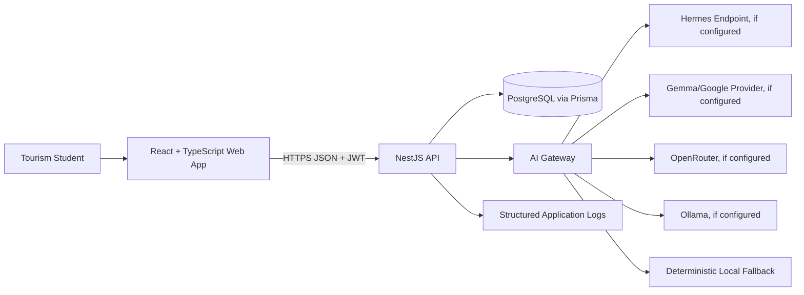
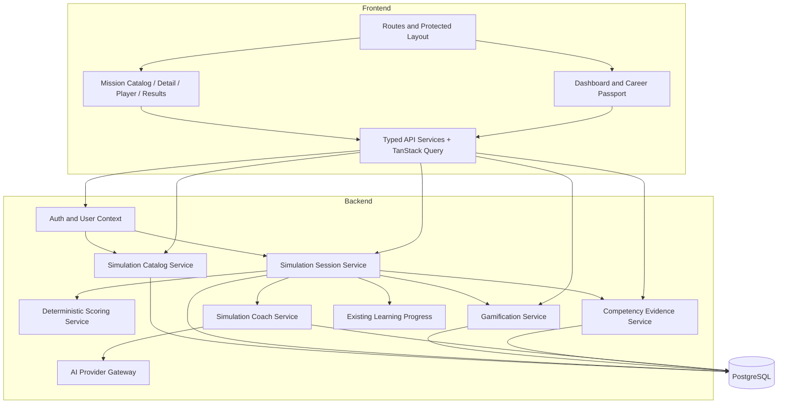
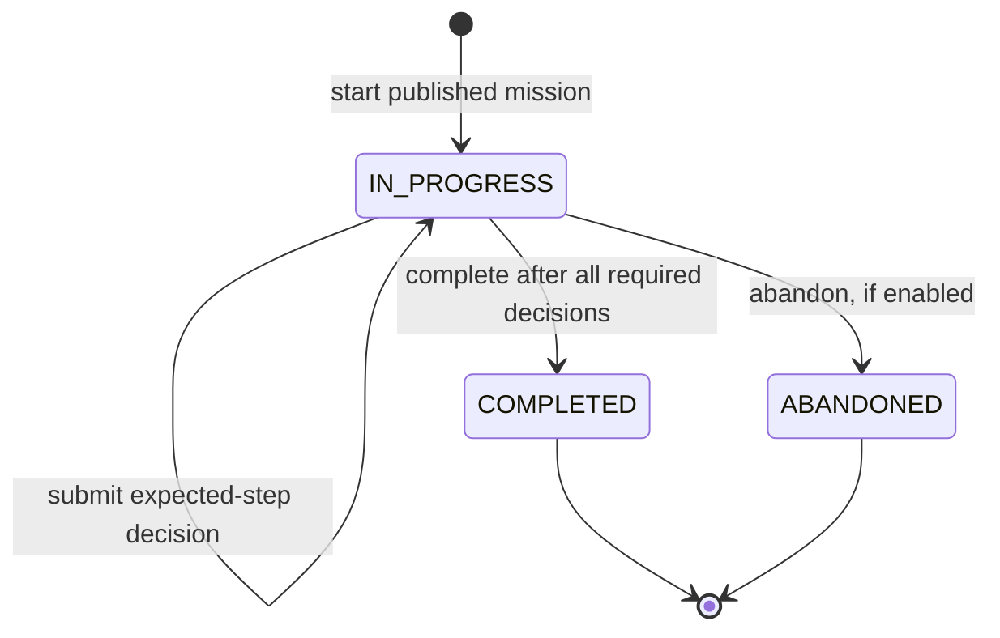

# Technical Design Document (TDD)

# TourMate Quest — Simulation, Progression, and AI Coaching

**Parent product:** TourMate AI  
**Repository:** `TourMate-AI-Game-Agent`  
**Status:** Proposed implementation design  
**Version:** 1.0  
**Date:** 2026-08-19

---

## 1. Purpose

This document defines the technical design for extending the existing TourMate AI application with:

- Versioned, branching tourism missions
- Persistent mission sessions and decisions
- Deterministic rubric scoring
- Server-backed XP and progression
- Competency evidence and Career Passport data
- AI narrative coaching with deterministic fallback
- Safe migration from browser-authoritative game state

The design is intentionally incremental. It does not replace the current React/NestJS/Prisma application.

---

## 2. Current Technical Baseline

The repository audit used for this design found the following architecture on the main branch. Claude must verify the active branch before implementing.

### 2.1 Frontend

- React with TypeScript
- Vite
- React Router
- TanStack Query
- Axios
- Tailwind CSS
- Framer Motion
- Geography-related packages such as D3/topology data
- Protected routes for dashboard and learning features
- Existing pages for subjects, lessons, notes, quizzes, flashcards, games, maps/flags, language, AI tutor, provider/agent status, profile, and progress

### 2.2 Backend

- NestJS
- Prisma
- PostgreSQL
- JWT authentication
- Global `/api` prefix
- Global validation with whitelisting/transformation and rejection of unknown properties
- Helmet and CORS configuration
- Existing modules for users, auth, subjects, lessons, notes, quizzes, flashcards, progress, AI, and agent behavior
- Jest/Supertest-capable backend test setup

### 2.3 Current database domain

The audited Prisma schema includes concepts equivalent to:

- User
- Email verification code
- Subject
- Lesson
- Note
- Quiz and question
- Quiz result
- Flashcard
- Progress
- Chat log

It does not yet contain a durable simulation, game profile, activity event, achievement, or competency-evidence model.

### 2.4 Known technical debt to confirm

- Frontend game state such as XP, level, badges, daily challenges, and notifications is persisted in browser storage in the current game hook.
- AI status logic includes multiple providers, but actual generation order and documented order are inconsistent.
- The audited AI generation path attempts Gemma, then OpenRouter, then Ollama, then local fallback; Hermes is status-checked but not invoked in that generation path.
- `GOOGLE_API_KEY` and `GEMMA_API_KEY` usage appears inconsistent.
- More than one Prisma schema location may exist.
- Frontend package scripts do not yet provide a dependable automated test gate.

These are audit findings, not permission for an unrelated rewrite.

---

## 3. Design Goals

1. Preserve existing functionality and data.
2. Deliver one complete mission before broad expansion.
3. Make mission completion deterministic and AI-independent.
4. Make scores, XP, and competency evidence reproducible and auditable.
5. Make retried requests safe.
6. Support mobile and intermittent connectivity through persisted state.
7. Keep provider-specific AI code behind one backend interface.
8. Allow new choice-based missions to be added primarily as data.
9. Preserve historical result meaning when mission content changes.
10. Keep the first implementation operationally simple.

---

## 4. Non-Goals

- Replacing the current frontend or backend framework
- Building a generic workflow engine
- Supporting arbitrary user-authored code in missions
- Live multiplayer
- Real airline, hotel, travel-booking, payment, or visa integrations
- AI-authoritative grading
- A complete instructor portal
- A new queue, event bus, or microservice architecture without a demonstrated need
- A full offline-first application in the first release

---

## 5. System Context



The browser never communicates directly with an AI provider using a secret key.

---

## 6. Target Logical Architecture



---

## 7. Module Design

### 7.1 `simulations` backend module

Responsibilities:

- Published mission catalog
- Mission detail retrieval
- Start/resume session
- Validate and record decisions
- Enforce session state and ownership
- Complete a session transactionally
- Return results and history

Suggested files:

```text
backend/src/simulations/
├── dto/
│   ├── list-simulations-query.dto.ts
│   ├── start-simulation-session.dto.ts
│   ├── submit-simulation-answer.dto.ts
│   └── complete-simulation-session.dto.ts
├── simulation.types.ts
├── simulation-scoring.service.ts
├── simulation-sessions.service.ts
├── simulations.controller.ts
├── simulations.service.ts
└── simulations.module.ts
```

Split catalog and session controllers only if the repository's existing style favors it.

### 7.2 `gamification` backend module

Responsibilities:

- One game profile per user
- XP policy
- Level calculation
- Idempotent activity/reward events
- Legacy import event
- Later achievement evaluation

Suggested files:

```text
backend/src/gamification/
├── gamification.controller.ts
├── gamification.service.ts
├── xp-policy.service.ts
└── gamification.module.ts
```

### 7.3 `competencies` backend module

For the first slice, this may be a small service inside simulations if creating a separate module adds unnecessary complexity. Its conceptual responsibilities are:

- Canonical competency definitions
- Mission/rubric mapping
- Evidence creation
- Career Passport aggregation

Extract it when more than one domain writes or reads competency evidence.

### 7.4 `ai` gateway refactor

Responsibilities:

- Provider registry
- Configuration and priority
- Health checks
- Generation with explicit timeout
- Error normalization
- Output schema validation
- Deterministic fallback selection
- Safe operational metadata

Preserve the existing AI tutor public behavior while moving provider calls behind the gateway.

---

## 8. Data Model

The exact names must follow the live schema. The following Prisma-style design expresses the required constraints.

### 8.1 Enums

```prisma
enum SimulationStatus {
  DRAFT
  PUBLISHED
  ARCHIVED
}

enum SimulationDifficulty {
  BEGINNER
  INTERMEDIATE
  ADVANCED
}

enum SimulationSessionStatus {
  IN_PROGRESS
  COMPLETED
  ABANDONED
}

enum FeedbackSource {
  AI
  DETERMINISTIC_FALLBACK
}

enum ActivityEventType {
  LEGACY_GAME_STATE_IMPORT
  LESSON_COMPLETED
  QUIZ_COMPLETED
  SIMULATION_COMPLETED
  SIMULATION_PERSONAL_BEST
  ACHIEVEMENT_UNLOCKED
  MANUAL_ADJUSTMENT
}
```

Do not add enum values that are not needed by the implementation. PostgreSQL enum changes require deliberate migrations.

### 8.2 Simulation definition

```prisma
model Simulation {
  id          String               @id @default(cuid())
  slug        String               @unique
  title       String
  summary     String
  subjectId   String?
  difficulty  SimulationDifficulty @default(BEGINNER)
  status      SimulationStatus     @default(DRAFT)
  createdAt   DateTime             @default(now())
  updatedAt   DateTime             @updatedAt

  subject     Subject?             @relation(fields: [subjectId], references: [id])
  versions    SimulationVersion[]

  @@index([status, subjectId])
}
```

A stable `Simulation` represents the mission identity. Content belongs to immutable or controlled `SimulationVersion` records.

### 8.3 Simulation version

```prisma
model SimulationVersion {
  id                   String              @id @default(cuid())
  simulationId         String
  version              Int
  role                 String
  context              String
  objectives           Json
  competencyCodes      Json
  scoringWeights       Json
  scorePolicyVersion   String
  estimatedStepCount   Int
  publishedAt          DateTime?
  createdAt            DateTime            @default(now())

  simulation           Simulation          @relation(fields: [simulationId], references: [id])
  steps                 SimulationStep[]
  sessions              SimulationSession[]
  relatedLessons        SimulationLesson[]

  @@unique([simulationId, version])
  @@index([simulationId, publishedAt])
}
```

A published version should be treated as immutable. Create a new version for changes affecting objectives, choices, or scoring.

### 8.4 Steps and options

```prisma
model SimulationStep {
  id                    String             @id @default(cuid())
  simulationVersionId   String
  orderIndex             Int
  title                  String
  prompt                 String
  guidance               String?
  createdAt              DateTime           @default(now())

  simulationVersion     SimulationVersion  @relation(fields: [simulationVersionId], references: [id])
  options                SimulationOption[]
  decisions              SimulationDecision[]

  @@unique([simulationVersionId, orderIndex])
  @@index([simulationVersionId])
}

model SimulationOption {
  id                    String             @id @default(cuid())
  stepId                String
  optionKey             String
  text                  String
  consequence           String
  rubricPoints          Json
  learningTags          Json
  createdAt             DateTime           @default(now())

  step                  SimulationStep     @relation(fields: [stepId], references: [id])
  decisions             SimulationDecision[]

  @@unique([stepId, optionKey])
  @@index([stepId])
}
```

`rubricPoints` is bounded JSON with a validated shape such as:

```json
{
  "communication": 4,
  "service-recovery": 3,
  "safety-policy-awareness": 4,
  "problem-solving": 3,
  "professionalism": 4
}
```

A normalized join table can replace JSON later if rubric authoring/query requirements justify it. For the first slice, bounded JSON reduces schema breadth while remaining versioned and validated.

### 8.5 Related lessons

```prisma
model SimulationLesson {
  simulationVersionId String
  lessonId            String
  relationType        String   @default("RECOMMENDED")
  orderIndex          Int      @default(0)

  simulationVersion  SimulationVersion @relation(fields: [simulationVersionId], references: [id])
  lesson             Lesson            @relation(fields: [lessonId], references: [id])

  @@id([simulationVersionId, lessonId])
}
```

Use an enum for `relationType` only if multiple stable types are required immediately.

### 8.6 Session and decisions

```prisma
model SimulationSession {
  id                    String                  @id @default(cuid())
  userId                String
  simulationVersionId   String
  status                SimulationSessionStatus @default(IN_PROGRESS)
  currentStepOrder      Int                     @default(0)
  startRequestKey       String?                 @unique
  startedAt             DateTime                @default(now())
  updatedAt             DateTime                @updatedAt
  completedAt           DateTime?
  abandonedAt           DateTime?

  user                  User                    @relation(fields: [userId], references: [id])
  simulationVersion     SimulationVersion       @relation(fields: [simulationVersionId], references: [id])
  decisions             SimulationDecision[]
  result                SimulationResult?

  @@index([userId, status, updatedAt])
  @@index([userId, simulationVersionId, startedAt])
}

model SimulationDecision {
  id          String             @id @default(cuid())
  sessionId   String
  stepId      String
  optionId    String
  requestKey  String?            @unique
  submittedAt DateTime           @default(now())

  session     SimulationSession  @relation(fields: [sessionId], references: [id])
  step        SimulationStep     @relation(fields: [stepId], references: [id])
  option      SimulationOption   @relation(fields: [optionId], references: [id])

  @@unique([sessionId, stepId])
  @@index([sessionId, submittedAt])
}
```

The service must verify that the step and option belong to the session's exact mission version.

### 8.7 Result

```prisma
model SimulationResult {
  id                     String          @id @default(cuid())
  sessionId              String          @unique
  overallScore           Int
  categoryScores         Json
  resultBand             String
  scorePolicyVersion     String
  deterministicFeedback  Json
  aiFeedback             Json?
  feedbackSource         FeedbackSource  @default(DETERMINISTIC_FALLBACK)
  aiProviderId           String?
  aiModelId              String?
  aiPromptVersion        String?
  xpAwarded              Int             @default(0)
  resultSnapshot         Json
  createdAt              DateTime        @default(now())
  updatedAt              DateTime        @updatedAt

  session                SimulationSession @relation(fields: [sessionId], references: [id])
  competencyEvidence     CompetencyEvidence[]
}
```

`resultSnapshot` should include the minimum immutable content required to explain the historical result, such as mission title/version, rubric weights, selected option keys/text excerpts, and deterministic evidence. Avoid unnecessarily duplicating all content.

### 8.8 Game profile and activity events

```prisma
model GameProfile {
  id          String   @id @default(cuid())
  userId      String   @unique
  xp          Int      @default(0)
  level       Int      @default(1)
  streakCount Int      @default(0)
  lastActiveOn DateTime?
  createdAt   DateTime @default(now())
  updatedAt   DateTime @updatedAt

  user        User     @relation(fields: [userId], references: [id])
}

model ActivityEvent {
  id               String            @id @default(cuid())
  userId           String
  type             ActivityEventType
  idempotencyKey   String            @unique
  xpDelta          Int               @default(0)
  sourceType       String?
  sourceId         String?
  policyVersion    String?
  metadata         Json?
  createdAt        DateTime          @default(now())

  user             User              @relation(fields: [userId], references: [id])

  @@index([userId, createdAt])
  @@index([userId, type])
}
```

The profile XP must equal the authoritative sum of applied XP events or be transactionally maintained with events. If denormalized for fast reads, include an integrity-check strategy.

### 8.9 Competency data

```prisma
model Competency {
  id          String   @id @default(cuid())
  code        String   @unique
  name        String
  description String
  createdAt   DateTime @default(now())
  updatedAt   DateTime @updatedAt

  evidence    CompetencyEvidence[]
}

model CompetencyEvidence {
  id            String   @id @default(cuid())
  userId        String
  competencyId  String
  resultId      String
  score         Int
  weight        Int
  evidence      String
  createdAt     DateTime @default(now())

  user          User             @relation(fields: [userId], references: [id])
  competency    Competency       @relation(fields: [competencyId], references: [id])
  result        SimulationResult @relation(fields: [resultId], references: [id])

  @@unique([resultId, competencyId])
  @@index([userId, competencyId, createdAt])
}
```

For the first slice, Career Passport may return evidence and simple aggregates without storing a separate aggregate table.

---

## 9. Data Validation Schemas

Bounded JSON must be validated both when seeding/publishing and when reading for scoring.

Example TypeScript types:

```ts
export const COMPETENCY_CODES = [
  'communication',
  'service-recovery',
  'safety-policy-awareness',
  'problem-solving',
  'professionalism',
] as const;

export type CompetencyCode = (typeof COMPETENCY_CODES)[number];

export type RubricPoints = Record<CompetencyCode, 0 | 1 | 2 | 3 | 4>;

export interface ScoringWeights {
  communication: 25;
  'service-recovery': 25;
  'safety-policy-awareness': 20;
  'problem-solving': 20;
  professionalism: 10;
}
```

Use a runtime validator available in the repository or explicit validation functions. Do not trust database JSON merely because it came from a seed.

---

## 10. Session State Machine



### Invariants

- A session belongs to exactly one user and mission version.
- `currentStepOrder` identifies the next required step.
- One decision exists per required step.
- The selected option belongs to that step.
- A completed session has exactly one result.
- A completed session cannot receive new decisions.
- `completedAt` is set once.
- A result's user is derived through the session; no client-supplied user ID is trusted.

### Concurrency

Two simultaneous answer or completion requests must not create conflicting state.

Recommended strategies:

- Unique database constraints for one decision per session/step and one result per session
- Transactional reads/writes
- Conditional update on expected state/current step
- Serializable or sufficiently strong transaction isolation where supported and necessary
- Catch unique conflicts and return the canonical existing resource for a matching retry

---

## 11. API Design

All examples are under the existing `/api` prefix and use the existing JWT mechanism.

### 11.1 List simulations

```http
GET /api/simulations?subjectId=&difficulty=&status=&page=&limit=
```

Student response includes metadata only, not answer scoring:

```json
{
  "items": [
    {
      "id": "sim_...",
      "slug": "delayed-flight-passenger-assistance",
      "title": "Delayed Flight Passenger Assistance",
      "summary": "Practice service recovery during a possible missed connection.",
      "subject": { "id": "...", "code": "AIRMGT", "name": "..." },
      "difficulty": "BEGINNER",
      "competencies": ["communication", "service-recovery"],
      "stepCount": 5,
      "learnerStatus": "NOT_STARTED",
      "latestScore": null,
      "bestScore": null
    }
  ],
  "page": 1,
  "limit": 12,
  "total": 1
}
```

Do not return `rubricPoints`, correct-option hints, or hidden coaching metadata in catalog responses.

### 11.2 Simulation detail

```http
GET /api/simulations/:slug
```

Response:

```json
{
  "id": "sim_...",
  "slug": "delayed-flight-passenger-assistance",
  "version": 1,
  "title": "Delayed Flight Passenger Assistance",
  "role": "Airport customer-service trainee",
  "context": "A passenger may miss a connection after a delay.",
  "objectives": ["..."],
  "competencies": [{ "code": "communication", "name": "Communication" }],
  "difficulty": "BEGINNER",
  "stepCount": 5,
  "relatedLessons": [{ "id": "...", "title": "...", "route": "..." }],
  "learner": {
    "status": "IN_PROGRESS",
    "activeSessionId": "session_...",
    "attemptCount": 0,
    "latestScore": null,
    "bestScore": null
  }
}
```

### 11.3 Start session

```http
POST /api/simulations/:slug/sessions
Idempotency-Key: client-generated-uuid
Content-Type: application/json

{
  "version": 1
}
```

Behavior:

- Validate published version.
- If policy is one active session per user/version, return the existing in-progress session unless `forceNew` is explicitly supported.
- Persist `startRequestKey` or equivalent.
- Return safe first-step data.

Response:

```json
{
  "sessionId": "session_...",
  "status": "IN_PROGRESS",
  "mission": {
    "slug": "delayed-flight-passenger-assistance",
    "title": "Delayed Flight Passenger Assistance",
    "version": 1,
    "role": "Airport customer-service trainee"
  },
  "progress": { "current": 1, "total": 5 },
  "step": {
    "id": "step_...",
    "order": 1,
    "title": "Open the interaction",
    "prompt": "...",
    "options": [
      { "id": "option_...", "text": "..." }
    ]
  }
}
```

Do not expose option rubric points.

### 11.4 Get/resume session

```http
GET /api/simulation-sessions/:sessionId
```

Return:

- Safe mission metadata
- Status
- Progress
- Current step for in-progress sessions
- Prior selected option IDs/text only as needed for review/resume
- Result link/summary for completed sessions

Enforce owner in the database query.

### 11.5 Submit answer

```http
POST /api/simulation-sessions/:sessionId/answers
Idempotency-Key: client-generated-uuid
Content-Type: application/json

{
  "stepId": "step_...",
  "optionId": "option_..."
}
```

Validation:

- Authenticated owner
- Session `IN_PROGRESS`
- Step is the expected current step
- Step belongs to session version
- Option belongs to step
- Request key not already used for a different payload

Response:

```json
{
  "accepted": true,
  "decision": {
    "stepId": "step_...",
    "optionId": "option_..."
  },
  "progress": { "current": 2, "total": 5 },
  "nextStep": {
    "id": "step_2",
    "order": 2,
    "title": "Establish what is known",
    "prompt": "...",
    "options": ["..."]
  },
  "canComplete": false
}
```

The first release may omit immediate consequence text to reduce answer-key leakage. If consequences are shown, return only pedagogically approved text after acceptance.

### 11.6 Complete session

```http
POST /api/simulation-sessions/:sessionId/complete
Idempotency-Key: client-generated-uuid
```

Completion must be safe to retry. Response:

```json
{
  "resultId": "result_...",
  "sessionId": "session_...",
  "overallScore": 82,
  "resultBand": "ON_TRACK",
  "categoryScores": {
    "communication": 90,
    "service-recovery": 80,
    "safety-policy-awareness": 75,
    "problem-solving": 80,
    "professionalism": 90
  },
  "deterministicFeedback": {
    "summary": "...",
    "strengths": ["..."],
    "improvements": ["..."],
    "nextAction": { "type": "LESSON", "id": "...", "label": "Review ..." }
  },
  "coachFeedback": {
    "status": "READY",
    "source": "DETERMINISTIC_FALLBACK",
    "content": { "summary": "...", "strengths": [], "improvements": [], "nextAction": "..." }
  },
  "reward": {
    "xpAwarded": 56,
    "totalXp": 240,
    "level": 3,
    "newPersonalBest": true
  }
}
```

If AI is generated separately, return `coachFeedback.status = "PENDING"` and provide a result endpoint that safely refreshes. Do not introduce asynchronous infrastructure unless the existing architecture supports it cleanly.

### 11.7 Get result

```http
GET /api/simulation-sessions/:sessionId/result
```

Owner-only. Returns the canonical result and current coaching state.

### 11.8 Game profile

```http
GET /api/gamification/me
```

Response:

```json
{
  "xp": 240,
  "level": 3,
  "xpToNextLevel": 60,
  "streak": 2,
  "recentEvents": [
    {
      "type": "SIMULATION_COMPLETED",
      "xpDelta": 56,
      "label": "Completed Delayed Flight Passenger Assistance",
      "createdAt": "..."
    }
  ]
}
```

The endpoint must not accept a user ID from the client.

---

## 12. Error Contract

Use the repository's global exception filter and add stable codes where compatible.

Example:

```json
{
  "statusCode": 409,
  "code": "SIMULATION_STEP_CONFLICT",
  "message": "This mission has already advanced. Refresh to continue from the current step.",
  "requestId": "req_..."
}
```

Recommended codes:

- `SIMULATION_NOT_FOUND`
- `SIMULATION_NOT_PUBLISHED`
- `SIMULATION_SESSION_NOT_FOUND`
- `SIMULATION_SESSION_NOT_ACTIVE`
- `SIMULATION_STEP_CONFLICT`
- `SIMULATION_OPTION_INVALID`
- `SIMULATION_INCOMPLETE`
- `SIMULATION_ALREADY_COMPLETED`
- `IDEMPOTENCY_KEY_REUSED`
- `AI_FEEDBACK_UNAVAILABLE` only for operational/internal use; student completion should use fallback

Do not reveal whether another user's session exists.

---

## 13. Completion Transaction

Recommended pseudo-code:

```ts
async completeSession(userId: string, sessionId: string): Promise<ResultDto> {
  const result = await prisma.$transaction(async (tx) => {
    const session = await loadOwnedSessionForUpdate(tx, userId, sessionId);

    if (session.result) {
      return loadCanonicalResult(tx, session.id);
    }

    assert(session.status === 'IN_PROGRESS');
    assertAllRequiredStepsAnswered(session);

    const score = scoringService.calculate({
      version: session.simulationVersion,
      decisions: session.decisions,
    });

    const priorBest = await findPriorBest(tx, userId, session.simulationVersion.simulationId);
    const reward = xpPolicy.calculate({ score, priorBest, attemptCount: ... });

    const createdResult = await tx.simulationResult.create(...);
    await createCompetencyEvidence(tx, userId, createdResult, score);

    const event = await createActivityEventOnce(tx, {
      idempotencyKey: `simulation_completion:${session.id}`,
      xpDelta: reward.xp,
      ...
    });

    await applyXpToGameProfile(tx, userId, event);
    await tx.simulationSession.update({
      where: { id: session.id },
      data: { status: 'COMPLETED', completedAt: new Date() },
    });

    return loadCanonicalResult(tx, session.id);
  });

  return attachAiFeedbackWithFallback(result);
}
```

Implementation notes:

- The database constraint on `SimulationResult.sessionId` is the final duplicate guard.
- If two completions race, catch the unique conflict and load the existing result.
- Create result/evidence/event/profile update/session completion in one transaction.
- AI generation should not cause the transaction to remain open.
- If AI is synchronous, call it after commit with a strict timeout, then update the result in a separate write.
- The deterministic response is always available.

---

## 14. Scoring Engine

### 14.1 Inputs

- Exact simulation version
- Ordered required steps
- Accepted decisions
- Option rubric points
- Category weights
- Score-policy version

### 14.2 Algorithm

For each competency category:

```text
earned = sum(selected option points for category)
maximum = sum(maximum option points available at each answered step for category)
categoryScore = maximum == 0 ? 0 : round(earned / maximum * 100)
```

Overall:

```text
overallScore = round(sum(categoryScore * categoryWeight / 100))
```

Validate:

- Every category in weights is known.
- Weights sum to 100.
- Option points are integers from 0 to 4.
- All required steps are represented.
- No decision references an option outside the version.

### 14.3 Result bands

```ts
function resultBand(score: number) {
  if (score >= 90) return 'SERVICE_READY';
  if (score >= 75) return 'ON_TRACK';
  if (score >= 60) return 'DEVELOPING';
  return 'PRACTICE_RECOMMENDED';
}
```

### 14.4 Deterministic feedback

Each option includes learning tags, for example:

```json
[
  "acknowledges-concern",
  "verifies-before-promising",
  "avoids-speculation",
  "offers-approved-next-step"
]
```

The feedback service:

1. Selects the strongest evidence tags by category.
2. Selects the lowest category or recurring risk tags.
3. Maps tags to reviewed feedback templates.
4. Selects a related lesson or replay action.
5. Produces bounded student-facing text.

This feedback is stored and displayed even without AI.

---

## 15. XP and Level Design

### 15.1 First-slice XP policy

First completed attempt for a mission version:

```text
20 base completion + floor(overallScore / 5) + 20 first-completion bonus
```

Range: 40–60 XP.

Replay:

```text
if new personal best:
  min(20, 10 + floor((newScore - previousBest) / 5))
else:
  0
```

### 15.2 Level calculation

Prefer a pure function. A simple first policy may use cumulative thresholds:

```ts
const LEVEL_THRESHOLDS = [0, 100, 250, 450, 700, 1000];
```

Do not hard-code thresholds in multiple frontend/backend files. Backend returns current level and progress to next level. Version the policy if changing it would reinterpret existing progression.

### 15.3 Event integrity

- `ActivityEvent.idempotencyKey` is globally unique.
- `GameProfile.xp` update occurs in the same transaction as event creation.
- Manual adjustments require a reason and authorized pathway; not part of first release.
- A periodic integrity check may compare profile XP to event totals.

---

## 16. Legacy Browser-State Migration

### 16.1 Problem

The current frontend may contain user-specific local keys for XP, badges, challenges, and notifications. Browser values are not inherently trustworthy and are device-specific.

### 16.2 Recommended approach

1. Add server game profile with zero/default state.
2. Add an authenticated one-time import endpoint only if preserving existing pilot values is necessary.
3. The frontend reads known legacy keys and sends a bounded import payload.
4. Backend validates type, allowed fields, maximum values, and whether the import event already exists.
5. Backend creates one `LEGACY_GAME_STATE_IMPORT` event and updates the profile transactionally.
6. Frontend marks/removes the legacy values after confirmed import.
7. All new reads and writes use the API.

### 16.3 Safer alternative

If the current app is not in meaningful production use or legacy values cannot be trusted, do not import XP. Start server progression at zero and document the product decision. Never silently mix arbitrary local values with server state.

---

## 17. AI Gateway Design

### 17.1 Interface

```ts
export interface AiProvider {
  readonly id: string;
  isConfigured(): boolean;
  healthCheck(signal?: AbortSignal): Promise<ProviderHealth>;
  generate(request: AiRequest, signal?: AbortSignal): Promise<AiResponse>;
}

export interface AiRequest {
  useCase: 'TUTOR_CHAT' | 'SIMULATION_COACH';
  systemPrompt: string;
  messages: Array<{ role: 'user' | 'assistant'; content: string }>;
  responseFormat?: 'TEXT' | 'JSON';
  metadata: {
    subjectCode?: string;
    promptVersion: string;
  };
}
```

### 17.2 Registry

```ts
@Injectable()
export class AiProviderRegistry {
  constructor(private readonly providers: AiProvider[], private readonly config: ConfigService) {}

  orderedConfiguredProviders(): AiProvider[] {
    const order = parseProviderOrder(this.config.get('AI_PROVIDER_ORDER'));
    return order
      .map((id) => this.providers.find((provider) => provider.id === id))
      .filter((provider): provider is AiProvider => Boolean(provider?.isConfigured()));
  }
}
```

Status endpoints and generation must use this same registry.

### 17.3 Provider order

Use a single environment value such as:

```text
AI_PROVIDER_ORDER=hermes,gemma,openrouter,ollama
```

Actual provider IDs depend on the live implementation. Remove ambiguous aliases or document them.

### 17.4 Timeout and fallback

- Give each provider an explicit timeout.
- Do not use unbounded retries.
- Normalize provider failures into categories: timeout, unavailable, configuration, quota, invalid output, unknown.
- Attempt the next configured provider only when policy permits.
- For simulation coaching, fall back to deterministic templates after provider exhaustion.
- For tutor chat, preserve the existing local fallback behavior where safe.

### 17.5 JSON validation

AI output for simulation coaching must be parsed and validated against a bounded schema:

```ts
interface CoachFeedback {
  summary: string; // e.g. 20–500 chars
  strengths: Array<{ competency: CompetencyCode; evidence: string }>;
  improvements: Array<{ competency: CompetencyCode; suggestion: string }>;
  nextAction: string;
}
```

Limits:

- Maximum three strengths
- Maximum three improvements
- No unknown competency codes
- No HTML
- No score fields
- Length limits on every string

When validation fails, record `invalid_output` and use deterministic fallback.

### 17.6 Prompt safety

The prompt must instruct the model:

- This is educational simulation feedback.
- Use only supplied mission evidence.
- Do not invent airline policy, legal rights, visa rules, compensation, or emergency procedures.
- Do not alter or recalculate scores.
- Be concise, respectful, and actionable.
- Return only the required JSON object.

---

## 18. Frontend Design

### 18.1 Routes

```text
/simulations
/simulations/:slug
/simulations/:slug/play
/simulation-sessions/:sessionId/results
/career-passport            # new or alias to extended /progress
```

Existing routes continue to work. `docs/IA.md` defines the broader navigation.

### 18.2 Pages

#### Missions catalog

- Page heading and short purpose
- Resume card when an active session exists
- Filter controls in later scope
- Mission cards with text status
- Loading skeleton
- Empty and error states

#### Mission detail

- Role/context
- Objectives
- Competencies
- Difficulty and step count
- Related lesson
- Attempt history summary
- Start/resume/replay primary action

#### Mission player

- Mission title and role
- Step `n of total`
- Step title and scenario prompt
- Radio-card or button-list options using semantic inputs/buttons
- One primary submit action
- Pending and conflict recovery
- No authoritative points exposed

#### Results

- Overall score and learning label
- Textual category score table/bars
- Deterministic summary
- Strengths and improvements
- AI coaching status/source, phrased for students rather than providers
- XP and personal-best result
- Related lesson action
- Replay action

### 18.3 API service

Use the existing Axios instance:

```ts
export const simulationsApi = {
  list(params?: SimulationListParams): Promise<SimulationListResponse>,
  getBySlug(slug: string): Promise<SimulationDetail>,
  start(slug: string, input: StartSessionInput, idempotencyKey: string): Promise<SimulationSession>,
  getSession(id: string): Promise<SimulationSession>,
  submitAnswer(id: string, input: SubmitAnswerInput, idempotencyKey: string): Promise<SubmitAnswerResponse>,
  complete(id: string, idempotencyKey: string): Promise<SimulationResult>,
  getResult(id: string): Promise<SimulationResult>,
};
```

Generate idempotency keys once per user action and retain them across automatic retries.

### 18.4 Query keys

```ts
const simulationKeys = {
  all: ['simulations'] as const,
  list: (filters: SimulationFilters) => ['simulations', 'list', filters] as const,
  detail: (slug: string) => ['simulations', 'detail', slug] as const,
  session: (id: string) => ['simulation-session', id] as const,
  result: (id: string) => ['simulation-result', id] as const,
};
```

Invalidate only affected catalog/detail/profile queries after completion.

### 18.5 State ownership

- Server/session data: TanStack Query
- Current unsubmitted option: local component state
- Idempotency key for current pending mutation: stable ref/state
- Navigation UI preferences: local state or safe local storage
- Authoritative XP/result/session state: never browser-only

### 18.6 Conflict recovery

If answer submission returns a step conflict:

1. Show a concise message.
2. Refetch the session.
3. Render the canonical expected step.
4. Do not automatically resubmit a now-invalid choice.

---

## 19. Information Security

### Authentication

- Reuse the existing JWT guard and request-user extraction.
- Never accept `userId` for current-user routes.
- Ensure token expiration/refresh behavior remains consistent.

### Authorization

Use queries equivalent to:

```ts
where: { id: sessionId, userId: authenticatedUserId }
```

or explicit ownership checks before any details are returned.

### Input

- Limit string lengths and array sizes.
- Validate UUID/CUID shape only if consistent with existing IDs.
- Reject unknown DTO properties through global validation.
- Do not accept rubric points, score, XP, or result band from the client.

### Output

- Do not return hidden option scoring.
- Do not return another user's identifiers or activity.
- Sanitize AI text and render as text, not trusted HTML.
- Mask provider operational errors.

### Abuse controls

Before public rollout:

- Rate-limit login/register/verification.
- Rate-limit AI tutor and coaching generation.
- Bound prompt/chat length.
- Bound mission mutation rate.
- Add monitoring for repeated unauthorized ID access.

---

## 20. Observability

### Structured logs

Recommended fields:

- Request/correlation ID
- Authenticated user ID or approved pseudonymous ID
- Route/use case
- Simulation/session/result ID
- State transition
- Idempotency outcome
- AI provider/model/prompt version
- AI latency and normalized failure category
- Fallback used

Never log:

- Passwords
- JWTs
- Provider keys
- Database connection strings
- Full private prompts by default
- Unnecessary personal profile data

### Metrics

- Mission starts/completions
- Completion failures by code
- Completion latency excluding and including AI
- Duplicate/idempotent replay count
- AI provider success/fallback rates
- XP event uniqueness errors
- Cross-user authorization denials

### Auditability

Activity events and result snapshots provide product-level audit evidence. They are not a substitute for infrastructure audit logs.

---

## 21. Performance Design

- Catalog query selects summary fields only.
- Mission detail returns options only when a session is active and only for the current step.
- Index by publication status/subject, user/session status, and event user/date.
- Keep completion transaction focused; do not call AI inside it.
- Use pagination for history and recent activity.
- Avoid returning full chat logs or all historical decisions in dashboard responses.
- Lazy-load heavier geography/game sections if current bundle analysis supports it.
- Measure before introducing caching layers.

---

## 22. Migration Plan

### Migration 1 — Game profile and activity events

- Add `GameProfile` and `ActivityEvent`.
- Add User relations.
- Create profile lazily on first read/write or backfill in a safe script.
- Do not import browser data automatically without the approved rule.

### Migration 2 — Simulation definitions

- Add simulation, version, step, option, and lesson relation records.
- Add indexes and uniqueness constraints.
- Seed competency definitions if included in this slice.

### Migration 3 — Sessions and results

- Add sessions, decisions, results, and evidence.
- Add one-result-per-session and one-decision-per-step constraints.

These may be combined if the repository's review/deployment workflow favors one coherent migration, but generated SQL must be reviewed.

### Seed

Seed:

- Five competency codes
- One `AIRMGT`-linked mission
- Version 1 with five steps and reviewed options
- Related lesson when a valid existing lesson can be identified

Use upsert or stable lookups to make seed reruns safe.

---

## 23. Testing Design

### 23.1 Unit tests

#### Scoring

- All-best path returns 100.
- Known mixed path returns exact category/overall scores.
- All-low path returns expected lower band.
- Invalid weights fail.
- Invalid point range fails.
- Missing required decision fails.

#### XP

- First completion formula.
- Replay with no improvement returns zero.
- Replay with improvement is capped.
- Level threshold boundaries.

#### Deterministic feedback

- Strongest and weakest evidence selection.
- Bounded output.
- Related lesson fallback.

#### AI validation

- Valid schema accepted.
- Unknown competency rejected.
- Excess item count rejected.
- HTML/oversized text rejected or sanitized according to policy.
- Timeout/provider failure selects fallback.

### 23.2 Backend integration tests

- List returns published only.
- Start requires auth.
- Start rejects draft.
- Start idempotency returns same session.
- Resume owner succeeds.
- Cross-user read/write/complete/result fails.
- Answer valid expected step succeeds.
- Wrong step and wrong option fail.
- Duplicate answer does not duplicate.
- Complete before all answers fails.
- Complete valid session creates result/evidence/event/profile update.
- Complete retry returns same result.
- Concurrent completion does not duplicate.
- AI disabled still completes.

### 23.3 Frontend tests

Add the smallest test setup compatible with the current Vite/React version if absent.

- Catalog loading, data, empty, and error
- Detail start/resume state
- Player selection and disabled submit
- Mutation failure and retry
- Step conflict refetch
- Result score/category text
- Fallback coaching state
- XP/personal-best display
- Protected route behavior

### 23.4 Browser/E2E

One critical path:

1. Authenticate test student.
2. Open Missions.
3. Start first mission.
4. Answer all steps.
5. Complete with AI disabled/mocked failure.
6. Verify score, XP, result, and Career Passport update.
7. Refresh result page.
8. Replay and verify old result remains.

Use two accounts for ownership tests at API level or E2E where practical.

---

## 24. Deployment and Configuration

### Backend configuration categories

- Database URL
- JWT/auth values
- Frontend origin/CORS
- AI provider order
- Provider-specific base URLs/models/keys
- Provider timeout
- Logging level
- Optional AI feature flag

Normalize names. Do not maintain both `GOOGLE_API_KEY` and `GEMMA_API_KEY` for the same purpose without a documented compatibility transition.

### Feature flags

A simple backend/environment flag may control rollout:

```text
SIMULATIONS_ENABLED=true
AI_SIMULATION_COACH_ENABLED=true
LEGACY_GAME_IMPORT_ENABLED=false
```

Do not build a full feature-flag platform for the first slice.

### Health checks

Verify or add checks for:

- API process
- Database connectivity
- Optional provider status reported separately from core health

An AI provider outage should not mark the entire application unhealthy if deterministic features work.

---

## 25. Rollout Plan

1. Deploy additive database migration.
2. Deploy backend with simulation feature disabled if deployment sequencing requires it.
3. Run safe seed for the first mission.
4. Verify API and ownership in staging/pilot environment.
5. Deploy frontend route/navigation.
6. Enable simulations for pilot users or environment.
7. Monitor completion, fallback, error, and duplicate-event metrics.
8. Review mission content and student feedback.
9. Expand to additional subjects only after the first slice meets gates.

Rollback should disable route/feature exposure without deleting result or progression data.

---

## 26. Technical Decisions

### TD-001 — Existing monolith retained

**Decision:** Keep React frontend and NestJS monolithic backend.  
**Reason:** Current scale and first-slice needs do not justify services or queues.

### TD-002 — Versioned mission content

**Decision:** Separate stable simulation identity from mission version.  
**Reason:** Historical scores must remain meaningful after edits.

### TD-003 — Bounded JSON for option points and result snapshots

**Decision:** Use validated JSON for small versioned structures in the first slice.  
**Reason:** Avoids excessive tables while preserving explicit validation and snapshot behavior. Revisit for authoring/analytics needs.

### TD-004 — Deterministic source of truth

**Decision:** Deterministic scoring and feedback always exist.  
**Reason:** Fairness, reproducibility, testability, and provider resilience.

### TD-005 — AI after commit

**Decision:** Do not call external AI inside the completion transaction.  
**Reason:** Avoid long locks and completion failure caused by providers.

### TD-006 — Activity-event idempotency

**Decision:** Every XP mutation is backed by a unique event.  
**Reason:** Retry safety and auditability.

### TD-007 — Preserve legacy routes

**Decision:** Add new IA without immediately deleting old URLs.  
**Reason:** Reduce regression and broken-link risk.

---

## 27. Implementation Sequence

1. Confirm repository baseline and canonical schema.
2. Add tests around existing game-state and AI behavior where needed to protect refactoring.
3. Add game profile/activity event migration and service.
4. Change dashboard/game reads to support server state, with controlled legacy handling.
5. Add simulation definition/session/result migration.
6. Add deterministic scoring and its unit tests.
7. Seed the first mission.
8. Add catalog/detail/start/resume/answer/complete/result APIs.
9. Add ownership/idempotency integration tests.
10. Add Missions catalog/detail/player/results frontend.
11. Add Career Passport progression integration.
12. Refactor AI calls behind the gateway and add coaching schema/fallback.
13. Add frontend tests and complete E2E/manual checks.
14. Update README, environment, route, API, and operations documentation.

Do not start by building all six subject missions.

---

## 28. Definition of Technical Completion

The first slice is technically complete when:

- A clean migration and seed produce the first mission.
- An authenticated student can complete the flow end to end.
- Refresh/resume works.
- Ownership checks pass.
- Answer and completion retries are idempotent.
- The exact score is reproducible from stored version/decisions.
- XP is server-owned and awarded once.
- Career Passport/dashboard reflects the result.
- AI failure does not block completion.
- Existing critical features pass regression checks.
- Narrow mobile and keyboard paths pass.
- Configuration and operational behavior are documented.

