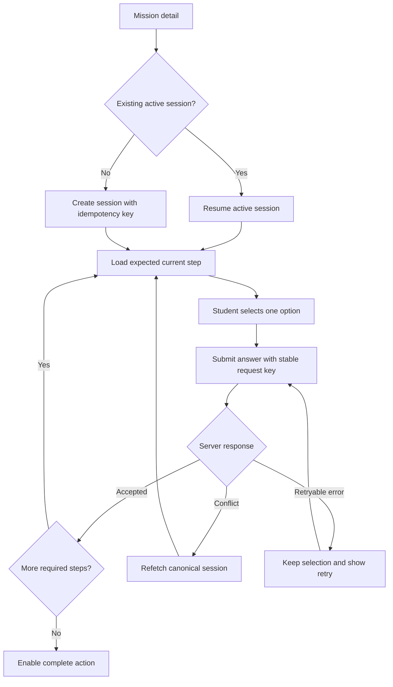
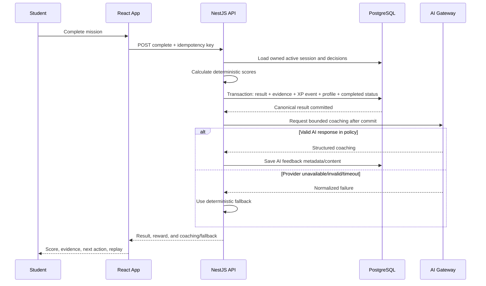
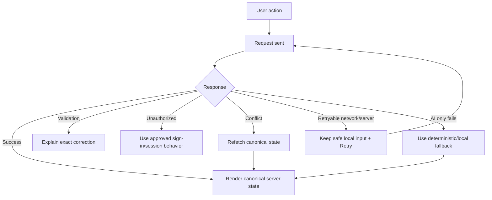

# User Flows (UF)

# TourMate Quest — Student Learning and Career Simulation

**Parent product:** TourMate AI  
**Version:** 1.0  
**Date:** 2026-08-19  
**Primary actor:** Authenticated BS Tourism Management student

---

## 1. Purpose

This document defines the intended user flows for the current TourMate AI learning features and the proposed TourMate Quest mission experience.

Each flow includes:

- Goal
- Entry point
- Preconditions
- Main path
- Alternate and failure paths
- Exit state
- Data or analytics events
- Acceptance notes

The flows describe learner behavior, not visual design details. Route and navigation structure are defined in `IA.md`.

---

## 2. Actors

### Student

The primary user who learns, practices, completes missions, receives feedback, and views progression.

### AI Coach

A backend-controlled enhancement that explains concepts or turns structured result evidence into coaching. It is not an authoritative scorer.

### Deterministic feedback engine

The guaranteed system fallback that calculates scores and creates reviewed template-based feedback.

### Instructor/content reviewer

A future or limited internal actor who validates mission objectives, choices, scoring, and publication status. Full authoring flows are outside the first release.

---

## 3. Shared State Terms

### Mission status for a student

- **Not started:** No active or completed session
- **In progress:** An owned session has unanswered required steps
- **Completed:** At least one completed result exists
- **Locked/unavailable:** Mission is not eligible or not published for the student

### Session status

- `IN_PROGRESS`
- `COMPLETED`
- `ABANDONED` when enabled

### Coaching status

- `READY_AI`
- `READY_FALLBACK`
- `PENDING` only if the selected implementation requests AI after result creation

---

# UF-01 — First Visit, Registration, and Initial Orientation

## Goal

A new student creates an account, enters the protected application, understands the main learning areas, and sees one useful next action.

## Entry points

- Public welcome/landing page
- Direct link to a protected route
- Registration link from login

## Preconditions

- Student is not authenticated.
- Frontend can reach the authentication API.

## Main path

1. Student opens the public welcome page.
2. Student sees a concise description: learn tourism concepts, practice missions, and track career skills.
3. Student selects **Create account**.
4. Student completes the existing registration fields.
5. Frontend validates obvious field errors before submission.
6. Backend validates, creates the account, and completes the current verification/authentication behavior.
7. Student signs in or is signed in according to the existing approved flow.
8. Student enters the Dashboard.
9. Dashboard introduces the primary areas:
   - Learn
   - Missions
   - World Lab
   - Language Lab
   - AI Coach
   - Career Passport
10. Dashboard shows one primary action, such as **Continue learning** or **Try your first mission**.
11. Student selects an activity.

## Alternate paths

### A. Email/account already exists

1. Backend returns the existing secure error behavior.
2. UI offers **Sign in** without exposing unnecessary account details.

### B. Validation error

1. UI keeps entered non-sensitive values.
2. The affected field receives a clear error.
3. Focus moves to the first error or an accessible error summary.

### C. Direct protected route

1. Student opens a protected mission or lesson URL.
2. Application stores the safe intended destination if current auth design supports it.
3. Student signs in.
4. Student returns to the intended route or Dashboard according to policy.

### D. Network failure

1. UI explains that account creation could not be completed.
2. Submit remains retryable.
3. The interface does not create multiple accounts after a delayed response.

## Exit state

- Authenticated account exists.
- Student is on Dashboard or the original protected destination.
- No game XP is awarded merely for visiting unless an approved onboarding rule exists.

## Events

- `user_registered`
- `login_succeeded`
- `dashboard_viewed`
- `primary_next_action_selected`

## Acceptance notes

- Existing authentication behavior must remain compatible.
- Passwords and tokens never appear in analytics/log events.
- Registration is usable by keyboard and on mobile.

---

# UF-02 — Returning Student Chooses the Next Activity

## Goal

A returning student quickly resumes meaningful work instead of searching through disconnected features.

## Entry point

- Login success
- Direct visit to `/dashboard`

## Preconditions

- Student is authenticated.
- Dashboard summary endpoints are available.

## Main path

1. Dashboard loads the student's server-backed summary.
2. The page shows:
   - Current XP and level
   - Current or recent learning progress
   - In-progress mission, when present
   - Latest result or competency insight
   - One recommended next activity
3. Priority for the main action:
   1. Resume an in-progress mission.
   2. Continue an in-progress lesson/activity.
   3. Follow a result-based recommendation.
   4. Start an available beginner mission.
   5. Browse Learn.
4. Student selects the action.
5. Application opens the correct route and retains context.

## Alternate paths

### A. No activity history

- Show a welcoming empty state and a beginner-friendly choice between Learn and first Mission.

### B. Summary partially fails

- Render available sections.
- Show a localized retry state for the failed section.
- Do not blank the entire dashboard unnecessarily.

### C. Legacy browser game state detected

- Follow the approved one-time reconciliation policy.
- Do not silently overwrite server progression.
- After success, all visible authoritative values come from the server.

## Exit state

- Student is in a selected learning or mission flow.

## Events

- `dashboard_viewed`
- `mission_resume_selected`
- `recommendation_selected`
- `legacy_game_state_imported` as a server activity event when applicable

## Acceptance notes

- The main action is not based on a hidden AI decision in the first release; transparent rules determine it.
- Game values survive refresh and a different signed-in device.

---

# UF-03 — Discover and Evaluate a Mission

## Goal

A student finds an appropriate published mission and understands its purpose before starting.

## Entry points

- Main navigation: Missions
- Dashboard recommendation
- Related mission link from a lesson
- Mission replay link from a result

## Preconditions

- Student is authenticated.
- At least one published mission is available.

## Main path

1. Student opens `/simulations`.
2. Application loads published mission summaries and the student's status.
3. Student sees a resume card first when an active session exists.
4. Student reviews mission cards showing:
   - Title
   - Subject
   - Short summary
   - Difficulty
   - Competencies
   - Step count
   - Not started/in progress/completed status
   - Latest or best score where appropriate
5. Student selects **Delayed Flight Passenger Assistance**.
6. Application opens `/simulations/delayed-flight-passenger-assistance`.
7. Student reviews:
   - Role
   - Scenario context
   - Learning objectives
   - Competencies
   - Related lesson
   - Attempt history summary
8. The primary action is one of:
   - Start mission
   - Resume mission
   - Replay mission
9. Student selects the primary action.

## Alternate paths

### A. No published missions

- Show an empty state that directs the student to Learn, not a broken blank page.

### B. Mission becomes unavailable

- Direct detail route returns a student-safe not-found/unavailable page.
- The page offers Missions catalog or related Learn action.

### C. Catalog error

- Show retry and retain filters.

### D. Student has an active session

- Detail page offers Resume as the primary action.
- Starting another session follows the approved active-session policy.

### E. Filters produce no results

- Explain that no missions match and provide **Clear filters**.

## Exit state

- Student starts/resumes/replays, or returns to the catalog/Learn.

## Events

- `simulation_catalog_viewed`
- `simulation_filter_changed`
- `simulation_viewed`
- `simulation_start_selected`
- `simulation_resume_selected`
- `simulation_replay_selected`

## Acceptance notes

- Draft missions do not appear.
- Hidden rubric points and answer hints are not exposed in catalog/detail APIs.
- Status is communicated in text, not color alone.

---

# UF-04 — Start, Play, Refresh, and Resume a Mission

## Goal

A student completes ordered decisions without losing progress, even after refresh or a retryable network problem.

## Critical flow diagram

## Entry point

- Start, Resume, or Replay from mission detail

## Preconditions

- Student is authenticated.
- Mission version is published for a new start.
- Student owns the session for resume.

## Main path

1. Frontend creates one stable idempotency key for the start action.
2. Backend creates or returns the canonical session.
3. Player route loads the session from the server.
4. Page shows:
   - Mission/role context
   - Step number and total
   - Step title and prompt
   - Three or four plausible options
   - One primary submit action
5. Student selects one option.
6. Submit becomes available.
7. Student submits.
8. Frontend disables duplicate activation while pending.
9. Backend validates ownership, state, expected step, and option membership.
10. Backend records one decision and advances the expected step.
11. Frontend renders the next step.
12. Steps repeat until all required decisions exist.
13. The player offers **View my result** or automatically performs the explicit completion action according to approved UX.

## Refresh/resume path

1. Student refreshes at any point after accepted decisions.
2. Frontend requests the session by ID.
3. Backend returns the expected current step and progress.
4. Player resumes without replaying already accepted writes.

## Alternate and failure paths

### A. Double click or repeated request

- The same idempotency key/unique constraints return one accepted decision.
- UI does not advance twice.

### B. Stale step conflict

1. Backend returns a conflict code.
2. UI explains that the mission state changed.
3. UI refetches the canonical session.
4. Student continues from the server's expected step.

### C. Network failure before response

1. UI keeps the selected option and stable request key.
2. Student selects Retry.
3. If the first request succeeded, backend returns the canonical existing decision.
4. If it did not, backend records it once.

### D. Invalid direct session ID

- Student sees the secure not-found behavior and a link to Missions.

### E. Session belongs to another user

- Backend returns secure not-found/forbidden behavior.
- No title, decision, or result data is leaked.

### F. Session already completed

- Player redirects or offers the canonical result route.

### G. Student navigates away

- Accepted server decisions remain.
- An optional confirmation appears only for an unsubmitted local selection, not every navigation.

## Exit state

- In-progress session with a known expected step, or
- Completed session ready for result calculation/view, or
- Safely exited with server state retained

## Events

- `simulation_started`
- `simulation_resumed`
- `simulation_step_viewed`
- `simulation_step_answered`
- `simulation_answer_retry`
- `simulation_state_conflict`

## Acceptance notes

- Client never submits a score or points.
- The current step is determined by the server.
- Accepted decisions survive refresh.
- The entire flow works by keyboard.

---

# UF-05 — Complete Mission and Receive Results

## Goal

A student completes the mission, receives a reproducible score and useful feedback, earns any valid reward once, and chooses a next action.

## Critical flow diagram

## Preconditions

- Student owns an in-progress session.
- All required steps have an accepted decision.

## Main path

1. Student activates the explicit completion action.
2. Frontend sends a stable completion idempotency key.
3. Backend verifies ownership and completeness.
4. Backend calculates category and overall scores from the exact mission version.
5. In one transaction, backend:
   - Creates one result
   - Creates competency evidence
   - Creates one XP/activity event
   - Updates game profile
   - Marks session completed
6. Backend commits before external AI work.
7. Backend obtains valid structured AI coaching or selects deterministic fallback.
8. Frontend opens `/simulation-sessions/:sessionId/results`.
9. Results page shows:
   - Overall score
   - Learning label
   - Category breakdown
   - Deterministic evidence
   - Coaching source/state in learner-friendly wording
   - XP awarded
   - New personal best when applicable
   - Related lesson or practice action
   - Replay action
10. Student chooses Review lesson, Replay, Return to Missions, or View Career Passport.

## Alternate and failure paths

### A. Completion request repeated

- Backend returns the existing canonical result.
- No additional result, XP, or evidence is created.

### B. Missing required decision

- Backend rejects completion.
- UI refetches session and returns to the missing expected step.

### C. AI unavailable

- Result page displays deterministic fallback immediately.
- Student does not see raw provider error details.
- Completion and XP remain valid.

### D. AI returns malformed output

- Backend validation rejects it.
- Fallback is displayed.
- Operational metadata records `invalid_output` safely.

### E. Result loaded directly after later login

- Owner can retrieve and view the stored result.
- Non-owner cannot.

### F. New personal best on replay

- Result identifies improvement.
- XP follows the documented replay policy.
- Older result remains unchanged.

### G. No personal-best improvement

- Result still records learning evidence.
- No replay XP is awarded under the first-slice anti-farming policy.
- UI explains progress without framing zero XP as failure.

## Exit state

- Completed result and evidence are stored.
- Student has selected or can select a next action.

## Events

- `simulation_completed`
- `simulation_result_viewed`
- `ai_feedback_generated`
- `ai_feedback_fallback_used`
- `xp_awarded`
- `personal_best_achieved`
- `result_next_action_selected`

## Acceptance notes

- Deterministic score is visible even when AI is off.
- Result copy says it is learning guidance, not an official grade.
- Category values have text equivalents, not chart-only meaning.

---

# UF-06 — View Career Passport and Competency Evidence

## Goal

A student understands current progression, practiced competencies, and evidence-backed next steps.

## Entry points

- Main navigation: Career Passport
- Dashboard XP/level card
- Mission results action
- Profile/progress link

## Preconditions

- Student is authenticated.

## Main path

1. Student opens `/career-passport` or the approved extended `/progress` route.
2. Page loads server-backed game profile, mission summary, and competency evidence.
3. Header shows:
   - Current level
   - XP and progress to next level
   - Streak when policy is implemented
4. Competency section shows each relevant competency with:
   - Learner-friendly name
   - Current evidence summary
   - Latest score/evidence
   - Best score where useful
   - Number of attempts/evidence items
5. Mission history shows latest and best results distinctly.
6. Recent activity explains why XP changed.
7. Recommended next action uses a transparent rule, such as lowest recent category linked to a lesson.
8. Student opens evidence details or follows a recommendation.

## Alternate paths

### A. No evidence yet

- Explain that Career Passport grows through lessons, quizzes, and missions.
- Offer a first mission or Learn action.

### B. Partial data unavailable

- Render game profile even if one evidence query fails, with localized retry.

### C. Competency cannot be calculated

- Show evidence items without inventing an aggregate level.
- Label insufficient evidence clearly.

## Exit state

- Student understands progress and selects a next action or returns to another area.

## Events

- `career_passport_viewed`
- `competency_evidence_opened`
- `activity_history_viewed`
- `passport_recommendation_selected`

## Acceptance notes

- Every competency claim traces to recorded evidence.
- The UI does not imply professional certification.
- Server values replace browser-authoritative XP.

---

# UF-07 — Ask the AI Tutor/Coach

## Goal

A student asks a tourism learning question and receives subject-aware help or a safe fallback.

## Entry points

- Main navigation: AI Coach
- Subject page Tutor action
- Related help action from a lesson or result

## Preconditions

- Student is authenticated.
- Prompt passes length and validation rules.

## Main path

1. Student opens AI Coach.
2. Student selects or inherits a subject context.
3. Page clearly states that the assistant supports learning and may make mistakes.
4. Student enters a question.
5. Frontend submits through the existing backend endpoint/gateway.
6. Gateway selects the first configured healthy provider according to one registry.
7. Backend returns a tourism-focused response.
8. Conversation history follows approved storage/retention behavior.
9. Student asks a follow-up or uses a suggested learning action.

## Alternate paths

### A. Primary provider fails

- Gateway tries the next provider according to explicit policy.

### B. All providers fail

- Existing local/deterministic fallback provides a useful limited response.
- UI does not expose secrets or raw infrastructure errors.

### C. Time-sensitive question

- Response acknowledges that rules may change and directs the learner to official/current sources.

### D. Unsafe or out-of-scope request

- Assistant redirects to safe educational support.

### E. Very long/invalid prompt

- UI shows a clear size/validation error before or after backend validation.

## Exit state

- Student receives help, a fallback, or a clear safe limitation.

## Events

- `ai_tutor_opened`
- `ai_tutor_requested`
- `ai_provider_succeeded`
- `ai_provider_failed`
- `ai_tutor_fallback_used`

## Acceptance notes

- Provider status and generation use the same registry.
- API keys never reach the browser.
- Tutor behavior remains compatible with existing subjects.

---

# UF-08 — Practice in World Lab

## Goal

A student practices tourism geography using maps, flags, countries, capitals, and future airport-code activities.

## Entry points

- Main navigation: World Lab
- Dashboard recommendation
- Related practice link from a subject/mission

## Preconditions

- Student is authenticated.
- Reviewed/static geography data is available.

## Main path

1. Student opens World Lab.
2. Student selects an activity type, such as Maps or Flags.
3. Student reviews brief instructions.
4. Application presents one item/question.
5. Student responds.
6. Application provides immediate reviewed feedback.
7. Progress within the activity is displayed.
8. At completion, application summarizes accuracy and offers replay or related learning.

## Alternate paths

### A. Asset/data fails to load

- Show retry and a text-friendly fallback where possible.

### B. Reduced motion or map interaction limitation

- Provide non-drag/button/list alternatives where required for accessibility.

### C. Incorrect response

- Explain the correct relationship without punishment.

## Exit state

- Activity result is recorded according to the current progress model.
- Student returns to World Lab, Dashboard, or a related mission.

## Events

- `world_lab_opened`
- `world_lab_activity_started`
- `world_lab_item_answered`
- `world_lab_activity_completed`

## Acceptance notes

- Answer keys come from reviewed data, not live AI generation.
- Existing Maps/Flags route remains accessible during IA migration.

---

# UF-09 — Practice in Language Lab

## Goal

A student practices tourism language and guest-service communication in a clear, simulated context.

## Entry points

- Main navigation: Language Lab
- Subject link
- Mission recommendation

## Preconditions

- Student is authenticated.
- Language exercise content is available.

## Main path

1. Student opens Language Lab.
2. Student selects a lesson, phrase set, vocabulary activity, or service role-play.
3. Application identifies the tourism context and learning objective.
4. Student completes the text-based activity.
5. Application provides reviewed answer feedback or constrained AI coaching.
6. Student saves progress and chooses another activity or related mission.

## Alternate paths

### A. AI role-play unavailable

- Provide static phrase/vocabulary practice or deterministic fallback.

### B. Unsupported speech/audio behavior

- Do not claim to assess pronunciation or accent unless a validated feature exists.
- Offer text-based practice.

### C. Sensitive identity/cultural content

- Use respectful, neutral examples and avoid stereotypes.

## Exit state

- Language practice result/progress is recorded according to supported capability.

## Events

- `language_lab_opened`
- `language_activity_started`
- `language_activity_completed`
- `language_roleplay_fallback_used`

## Acceptance notes

- Existing Language route remains functional.
- AI feedback evaluates the supplied task, not the student's identity or unsupported characteristics.

---

# UF-10 — Move from Lesson to Mission and Back

## Goal

A student applies a lesson through a related mission, then returns to the exact learning content needed for improvement.

## Entry point

- Subject lesson page
- Mission result page

## Preconditions

- A reviewed relation exists between a lesson and mission version.

## Main path: lesson to mission

1. Student completes or views a lesson.
2. Page shows **Practice this in a Mission**.
3. Student opens mission detail with subject context preserved.
4. Student starts/completes the mission.
5. Result page references the related lesson.

## Main path: result to lesson

1. Result identifies a developing competency or learning tag.
2. Deterministic recommendation maps it to a reviewed lesson.
3. Student selects **Review lesson**.
4. Application opens the exact lesson route.
5. After review, the lesson offers **Replay mission** when appropriate.

## Alternate paths

### A. Related lesson was removed/unpublished

- Do not show a broken link.
- Fall back to subject overview or Missions catalog.

### B. Multiple related lessons

- Show one primary recommendation and optional secondary choices.

## Exit state

- Student continues a connected learn-practice-reflect cycle.

## Events

- `lesson_related_mission_selected`
- `result_related_lesson_selected`
- `lesson_to_replay_selected`

## Acceptance notes

- Relations are stored as reviewed data.
- AI may explain the recommendation but does not invent the destination URL.

---

# UF-11 — Handle Network, Server, and AI Failures

## Goal

A student can recover from failure without duplicate progress or losing accepted work.

## Entry points

- Any server-backed activity

## General recovery flow

## Rules

- Preserve unsubmitted non-sensitive input for retry.
- Reuse the same idempotency key for retrying the same write.
- Generate a new key only for a genuinely new user action.
- Never show a success state based only on optimistic assumption for rewards/completion.
- After conflict, trust and render the server state.
- Do not display stack traces, database errors, provider keys, or raw provider responses.
- AI failure is localized; it does not turn a successful mission result into a failure.

## Exit state

- Recovered canonical state, or
- Clear retry/return action without data corruption

## Events

- `request_retry_selected`
- `state_conflict_recovered`
- `critical_flow_error`
- `ai_feedback_fallback_used`

---

# UF-12 — Secure Cross-User Access Rejection

## Goal

Prevent one student from reading or changing another student's mission and progression data.

## Preconditions

- Student A owns a session/result.
- Student B is authenticated separately.

## Flow

1. Student B requests Student A's session ID through read, answer, complete, or result endpoint.
2. Backend performs a query constrained by both resource ID and Student B's authenticated user ID, or an equivalent explicit ownership check.
3. No owned record is found.
4. Backend returns the repository-standard secure error.
5. Response contains no mission decisions, result, owner identity, or existence detail.
6. An operational authorization-denial event may be logged without leaking content.

## Acceptance notes

This flow is primarily validated by automated API tests using two accounts. Frontend route guards are not sufficient.

---

# UF-13 — Future Instructor Reviews and Publishes a Mission

## Status

Post-MVP conceptual flow. Data modeling should not block it, but no complete authoring UI is required for the first release.

## Goal

An authorized reviewer verifies content and publishes an immutable mission version.

## Main path

1. Reviewer creates or receives a draft version.
2. Reviewer inspects:
   - Subject and objectives
   - Role/context
   - Every step and option
   - Consequence text
   - Rubric points and weights
   - Competency mapping
   - Related lessons
   - Safety/cultural review notes
3. Automated validation confirms:
   - Ordered steps
   - Required option count
   - Point range
   - Weights sum to 100
   - Stable slug/version
4. Reviewer previews the student flow.
5. Reviewer approves and publishes.
6. Version becomes immutable for new sessions.
7. Future edits create a new draft version.

## Alternate path

- Rejected content returns to draft with review notes.

## Acceptance notes

- Publishing requires explicit authorization.
- Existing sessions/results stay tied to their version.

---

## 4. Cross-Flow Navigation Rules

- Back navigation must not resubmit a write.
- A completed session should resolve to its result instead of reopening the player.
- An in-progress session should resolve to its expected step.
- Authentication redirects should preserve a safe intended route where supported.
- Legacy URLs should continue to resolve during IA migration.
- The primary action per page should be visually and semantically clear.
- Breadcrumbs are useful on deep Learn routes; they are optional on the focused mission player where they may distract.

---

## 5. Cross-Flow Accessibility Rules

- Page changes have a clear level-one heading.
- Keyboard focus is not trapped except in intentional, accessible dialogs.
- Errors are announced and linked to affected controls.
- Status chips include readable text.
- Score bars have text labels and numeric values.
- One decision can be completed without drag, hover, or pointer precision.
- Reduced-motion preference applies to transitions and celebration effects.
- Timeout behavior does not remove a student's accepted work.

---

## 6. Cross-Flow Analytics Rules

- Analytics must not contain passwords, tokens, provider keys, or full private chat content.
- Use stable event names and approved identifiers.
- Record product outcomes, not every cursor movement.
- Differentiate deterministic fallback from AI feedback success.
- Differentiate mission start, resume, completion, replay, and personal best.
- Treat analytics as optional to core transaction success; analytics failure must not block learning.

---

## 7. Flow-to-Route Matrix

| Flow | Primary routes |
|---|---|
| UF-01 Registration/orientation | `/welcome`, `/register`, `/login`, `/dashboard` |
| UF-02 Returning dashboard | `/dashboard` |
| UF-03 Discover mission | `/simulations`, `/simulations/:slug` |
| UF-04 Play/resume | `/simulations/:slug/play` with server session ID, or approved session-player route |
| UF-05 Results | `/simulation-sessions/:sessionId/results` |
| UF-06 Career Passport | `/career-passport` and/or compatible `/progress` |
| UF-07 AI Coach | `/ai-tutor` or future `/ai-coach` alias |
| UF-08 World Lab | `/maps-flags` and future `/world-lab` alias |
| UF-09 Language Lab | `/language` and future `/language-lab` alias |
| UF-10 Lesson ↔ mission | Existing lesson routes plus mission routes |
| UF-11 Failure recovery | All server-backed routes |
| UF-12 Cross-user rejection | API behavior; no dedicated UI route |

---

## 8. First-Release UAT Flow Set

The minimum end-to-end acceptance run is:

1. Register or sign in.
2. Open Dashboard.
3. Open Missions.
4. View Delayed Flight Passenger Assistance.
5. Start mission.
6. Submit two steps.
7. Refresh and verify resume.
8. Complete remaining steps.
9. Disable or fail AI and complete successfully.
10. Verify deterministic result, category scores, XP, and related lesson.
11. Refresh result.
12. Open Career Passport and verify evidence.
13. Replay and create a new result.
14. Retry the same completion request and verify no duplicate XP.
15. Use a second account to verify cross-user rejection.
16. Regression-check Learn, quiz, flashcards, maps/flags, language, AI tutor, profile, and progress.

